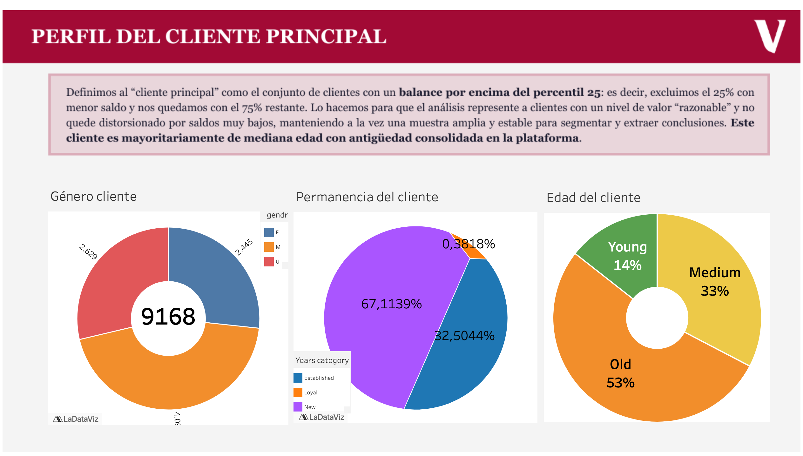

# Project 2 · EDA and Inferential Stats · A/B Testing

*Análisis de comportamiento y contraste de hipótesis sobre funnel digital*

**Julio Beltrán Peiró & Juan José Ruiz Bellido**

---

## Índice

1. [Objetivo](#objetivo)
2. [Instalación](#instalacion)
3. [Cómo replicar el proyecto](#como-replicar)
4. [Estructura del proyecto](#estructura-proyecto)
5. [Contexto de negocio](#contexto-negocio)
6. [Dataset](#dataset)
7. [Notebook 0 · Perfil de cliente principal](#nb0)
8. [Notebook 1 · Métricas de rendimiento](#nb1)
9. [Notebook 2 · Testing](#nb2)
10. [Tableau](#tableau)
11. [Resultados / Insights](#resultados-insights)
12. [Limitaciones y próximos pasos](#limitaciones-proximos-pasos)
13. [Licencia](#licencia)

---

<a id="objetivo"></a>
## Objetivo

El objetivo de este proyecto es analizar los resultados de un experimento A/B realizado en el área de Experiencia de Cliente (CX) de Vanguard. La hipótesis de negocio plantea que una interfaz digital más moderna e intuitiva, junto con indicaciones contextuales oportunas (señales, mensajes o sugerencias mostradas durante la tarea), puede simplificar el proceso online para los clientes.

La pregunta clave que guía el análisis es: **¿estos cambios aumentan la proporción de clientes que completa el proceso?**

---

<a id="instalacion"></a>
## Instalación

Requisitos:
- `Python 3.13.9` (base usada durante el proyecto).
- [Tableau Public (Desktop Edition)](https://www.tableau.com/products/public/download) para abrir y reproducir la parte de visualización (`.twbx`).

```bash
# desde la carpeta project2-cx-julio-juanjo/
/opt/anaconda3/bin/python -m venv --system-site-packages .venv_project2
source .venv_project2/bin/activate

python -m pip install -r requirements.txt
```

Opcional (kernel de Jupyter):

```bash
python -m ipykernel install --user --name project2-cx-julio-juanjo --display-name "Python (project2-cx-julio-juanjo)"
```

---

<a id="como-replicar"></a>
## Cómo replicar el proyecto

Orden recomendado:

1. Ejecutar `notebooks/0_perfil_cliente_principal.ipynb`.
2. Ejecutar `notebooks/1_metricas_rendimiento.ipynb`.
3. Ejecutar `notebooks/2_testing.ipynb`.
4. Abrir `Tableau/TableauProject2.twbx` en Tableau Public para reproducir dashboards/historia.

Notas de reproducibilidad:
- Los notebooks descargan parte de los datos desde URLs públicas del bootcamp.
- Algunos notebooks cargan ficheros limpios con *timestamp* (por ejemplo `*_df2_merged.csv`); si regeneras datos, actualiza esos nombres en celdas de carga.
- Las dependencias runtime están fijadas en `requirements.txt`.
- El entorno local del proyecto está estandarizado en `.venv_project2` (no se trackea en git).
- Descarga de Tableau Public: [https://public.tableau.com/](https://public.tableau.com/) o [https://www.tableau.com/products/public/download](https://www.tableau.com/products/public/download).

---

<a id="estructura-proyecto"></a>
## Estructura del proyecto

```text
project2-cx-julio-juanjo/
  README.md
  requirements.txt
  requirements-dev.txt
  notebooks/
    0_perfil_cliente_principal.ipynb
    1_metricas_rendimiento.ipynb
    2_testing.ipynb
  src/
    functions.py
  data/
    cleaned/
  Tableau/
    insights/
      insight_perfil_cliente_principal.png
      insight_perfil_cliente_principal2.png
    TableauProject2.twbx
```

---

<a id="contexto-negocio"></a>
## Contexto de negocio

Vanguard lanzó una prueba A/B para validar si una nueva interfaz digital —más moderna, intuitiva y con indicaciones contextuales en cada paso— mejora la experiencia de cliente y aumenta la finalización del proceso online. En este proyecto estructuramos la respuesta de negocio en dos frentes complementarios:

1. **Perfil de cliente principal** (`notebooks/0_perfil_cliente_principal.ipynb`): construimos un perfil demográfico-operativo para segmentación (comunicación, publicidad y futuras mejoras de UX). El subset `high_value_client` contiene **9,168 clientes**, que representan **18.15%** del total de usuarios analizados en el experimento (`df_demo_ab`: **50,500**).
2. **Validación estadística del experimento A/B** (`notebooks/1_metricas_rendimiento.ipynb` + `notebooks/2_testing.ipynb`): medimos rendimiento del funnel y contrastamos hipótesis para comprobar si el diseño `Test` es estadísticamente más eficaz que `Control` en conversión y velocidad, y si los grupos están equilibrados en variables de contexto.

Estos dos bloques se apoyan en el análisis previo del pipeline completo (`notebooks/` + `src/functions.py`), desde limpieza y construcción de datasets hasta cálculo de métricas e inferencia.

---

<a id="dataset"></a>
## Dataset

**Fuentes de datos**

| Fuente | Tipo | Qué aporta | Estado |
|--------|------|-----------|--------|
| `df_final_demo.txt` (bootcamp) | TXT/CSV | Perfil demográfico por `client_id` (`clnt_age`, `gendr`, `bal`, `calls_6_mnth`, `logons_6_mnth`, etc.) | ✅ |
| `df_final_web_data_pt_1.txt` + `df_final_web_data_pt_2.txt` (bootcamp) | TXT/CSV | Eventos del funnel (`start`, `step_1`, `step_2`, `step_3`, `confirm`) con `date_time` | ✅ |
| `df_final_experiment_clients.txt` (bootcamp) | TXT/CSV | Asignación al experimento A/B (`Variation`: `Control` / `Test`) | ✅ |

**Scope**

- Ámbito analítico: experimento A/B del proceso digital y su funnel.
- Granularidad principal:
  - Evento (`client_id`, `visitor_id`, `visit_id`, `process_step`, `date_time`).
  - Cliente (`client_id` + variables demográficas y de comportamiento).
- Segmentación de experimento: `Variation` (`Control` y `Test`).
- El objetivo operativo en los notebooks ha sido:
  - Definir **cliente principal** y **perfil demográfico**: entender la lógica de negocio para caracterizar este perfil.
  - Medir **tasa de finalización**, **tiempo dedicado** y **tasa de error** (KPIs).
  - Realizar **testing** (finalización, velocidad hasta `confirm`, edad y permanencia).

**Datasets de trabajo (pipeline del proyecto)**

- `df1` (`demo`): base demográfica.
- `df2` (`web events`): merge de `pt_1 + pt_2` limpio en `data/cleaned/*_df2_merged.csv`.
- `df3` (`experiment clients`): asignación `Variation`.

**Datasets finales usados en análisis/visualización**

- `high_value_client` (perfil de cliente principal):
  - Se construye para representar el perfil más frecuente de uso digital: filtramos clientes con `logons_6_mnth >= moda` (la moda observada coincide con `9`) y `calls_6_mnth >= moda` (la moda observada coincide con `6`).
  - Después incorporamos criterio de valor económico con `bal > P25` (por encima del percentil 25), de modo que excluimos el cuartil inferior y trabajamos con el 75% superior de balances.
  - Finalmente añadimos categorías discretas para segmentar: `Age_category` (edad) y `Years_category` (antigüedad).
- `df_demo_ab`:
  - Es el perfil demográfico por cliente enriquecido con `Variation` (`Control`/`Test`).
  - Se usa para comparar grupos del experimento en variables de contexto (por ejemplo edad o permanencia).
- `df_times`:
  - Recoge el tiempo por usuario hasta `confirm`: inicio de sesión (`t0`), momento de confirmación (`t_confirm`) y diferencia temporal (`time_to_confirm`, `time_to_confirm_seconds`), además de `Variation`.
  - Es la base del test de velocidad entre Control y Test.
- `df_events_ab`:
  - Contiene los eventos del funnel (`start`, `step_1`, `step_2`, `step_3`, `confirm`) enriquecidos con `Variation`.
  - Se usa para visualizaciones de flujo y pasos en Tableau.

**Diccionario breve (datasets finales)**

`high_value_client` (por cliente; subset de clientes “alto valor”):
- `client_id`: identificador único del cliente.
- `clnt_tenure_yr`: antigüedad del cliente en años.
- `clnt_tenure_mnth`: antigüedad del cliente en meses.
- `clnt_age`: edad del cliente.
- `gendr`: género del cliente (`M`, `F`, `U`).
- `num_accts`: número de cuentas/productos asociados al cliente.
- `bal`: balance/saldo del cliente.
- `calls_6_mnth`: número de llamadas en los últimos 6 meses.
- `logons_6_mnth`: número de inicios de sesión en los últimos 6 meses.
- `Age_category`: rango de edad (`Young`, `Medium`, `Old`).
- `Years_category`: tipología por antigüedad (`New`, `Established`, `Loyal`).

`df2_merged` / `df_events_ab` (por evento):
- `client_id`: identificador de cliente.
- `visitor_id`: identificador de visitante.
- `visit_id`: identificador de sesión/visita.
- `process_step`: paso del funnel (`start`, `step_1`, `step_2`, `step_3`, `confirm`).
- `date_time`: timestamp del evento.
- `Variation` (solo en `df_events_ab`): grupo del experimento (`Control` / `Test`).

`df_times` (por cliente con primera sesión que confirma):
- `client_id`: identificador de cliente.
- `visit_id`: sesión usada para el cálculo.
- `t0`: primer timestamp de la sesión.
- `t_confirm`: timestamp de `confirm`.
- `time_to_confirm`: diferencia temporal entre `t_confirm` y `t0`.
- `time_to_confirm_seconds`: `time_to_confirm` en segundos (float).
- `Variation`: grupo del experimento (`Control` / `Test`).

---

<a id="nb0"></a>
## Notebook 0 · Perfil de cliente principal

En este notebook construimos el perfil de cliente principal a partir de `df_final_demo.txt`: limpiamos nulos, filtramos el comportamiento más frecuente de uso digital (`logons_6_mnth` >= moda y `calls_6_mnth` >= moda), aplicamos un criterio económico (`bal` > P25) para evitar perfiles con balance `0` y segmentamos con categorías de edad y antigüedad (`Age_category`, `Years_category`). El resultado es un perfil demográfico operativo (`high_value_client`) y una base demográfica general para análisis comparativo.

---

<a id="nb1"></a>
## Notebook 1 · Métricas de rendimiento

En este notebook consolidamos los eventos web (`pt_1` + `pt_2`) y calculamos las métricas clave del funnel: tasa de finalización, tiempo medio entre pasos y tasa de error por retrocesos dentro del flujo. El objetivo es obtener una foto clara del rendimiento del proceso digital antes del contraste inferencial, dejando métricas descriptivas comparables y trazables.

---

<a id="nb2"></a>
## Notebook 2 · Testing

En este notebook realizamos el contraste estadístico del experimento A/B entre `Control` y `Test`: test de diferencia en tasa de finalización, validación del crecimiento relativo frente al umbral de negocio, test de velocidad hasta `confirm` por usuario y tests de equilibrio (edad y permanencia). Además, generamos los datasets finales para visualización en Tableau (`df_times`, `df_demo_ab`, `df_events_ab`).

---

<a id="tableau"></a>
## Tableau

En este proyecto, Tableau no se usó solo para “hacer gráficas”, sino como una capa analítica y de comunicación: trasladamos los datasets finales de Python (high_value_client, df_demo_ab, df_times, df_events_ab) a dashboards y una historia interactiva donde estructuramos el contexto, el perfil del cliente principal, las métricas de rendimiento y los cuatro contrastes de hipótesis del A/B test. Esto nos permitió validar y enriquecer los hallazgos estadísticos con una narrativa visual más ejecutiva, clara y navegable, incorporando filtros, comparativas y vistas interactivas que facilitaron tanto el análisis como la presentación final del proyecto en un único entorno.

---

<a id="resultados-insights"></a>
## Resultados / Insights

**Notebook 0 · Perfil de cliente principal (`high_value_client`)**

- El perfil del cliente principal se concentra en edades altas:`Age_category = Old` (**52.9%**) domina claramente frente a `Medium` (**32.6%**) y `Young` (**14.4%**).
- Por tenencia, predomina `New` (2–15 años) (**67.1%**), seguido de `Established` (15–35 años) (**32.5%**), mientras que `Loyal` es residual (**0.4%**).
- En el cruce `Age_category` x `Years_category`, `Old` sigue siendo la categoría dominante incluso dentro de `New`, lo que sugiere que el cliente típico no es necesariamente joven aunque su cuenta sea relativamente reciente; en `Loyal`, `Old` representa **82.9%**.

**Notebook 1 · Métricas de rendimiento del flujo**

- La tasa global de finalización del proceso es **67.53%** (aprox. 2 de cada 3 usuarios llegan a `confirm`).
- El tiempo medio por transición es:
  - `start → step_1`: **32.05 s**
  - `step_1 → step_2`: **35.26 s**
  - `step_2 → step_3`: **88.50 s**
  - `step_3 → confirm`: **32.05 s**
- El principal cuello de botella operativo está en `step_2 → step_3`.
- La tasa de error (retrocesos en el funnel) es **10.42%**. No se considera error volver a pasos tras `confirm`, porque se interpreta como posible revisión/navegación posterior.

**Notebook 2 · Testing A/B (`Control` vs `Test`)**

- Descriptivo inicial:
  - `Control`: **65.59%** de finalización.
  - `Test`: **69.00%** de finalización.
- **Test 1 (tasa de finalización)**: `p-value = 8.01e-19` (`< 0.05`) ⇒ se rechaza H0; hay diferencia estadísticamente significativa entre grupos.
- **Lift relativo de negocio**: **+5.64%** de crecimiento relativo de finalización (`Test` sobre `Control`), superando el umbral del **5%**.
- **Test 2 (velocidad hasta confirm por usuario)**: `p-value = 1.324e-05` (`< 0.05`) ⇒ diferencia significativa; el grupo `Test` completa en menos tiempo (**~19.97 s menos en media** y **~36 s menos en mediana** frente a `Control`).
- **Test 3 (edad promedio)**: `p-value = 0.0157` (`< 0.05`) ⇒ existe diferencia estadística en edad promedio entre grupos.
- **Test 4 (permanencia promedio)**: `p-value = 0.0870` (`> 0.05`) ⇒ no se rechaza H0; no hay evidencia de diferencia en permanencia.
- Lectura conjunta: el nuevo diseño mejora finalización y velocidad, y además cumple el umbral de negocio; la permanencia no introduce sesgo relevante en la comparación.

**Insights derivados directamente de Tableau (historia)**

- Historia: `Perfil Cliente Principal` → el cliente principal es mayoritariamente `male`, `old` y `established`.

- Historia: `Cliente principal 2` → la visualización de dispersión permite inferir que el perfil `medium` concentra un comportamiento de inversión relativamente más agresivo (`bal`, `clnt_age`, `clnt_tenure_yr`). El cruce edad/permanencia añade otra lectura: existen clientes `Young` con antigüedad alta en `clnt_tenure_yr`, lo que puede ser consistente con casos de titularidad heredada o cuenta previa.


---

<a id="limitaciones-proximos-pasos"></a>
## Limitaciones y próximos pasos

**Limitaciones (MVP)**

- El análisis se basa en un periodo concreto del experimento (`15/03/2017` a `20/06/2017`) y en los datasets del bootcamp; no incorpora histórico adicional ni comportamiento posterior al test.
- El cálculo de velocidad hasta `confirm` se ha definido con una regla operativa (primera sesión que confirma por `client_id`), válida para este proyecto pero mejorable para escenarios con múltiples sesiones complejas.
- La segmentación de `high_value_client` es descriptiva y de negocio (`moda` de uso + `bal > P25`); no es un modelo predictivo ni implica causalidad por sí sola.
- El flujo de trabajo se ejecuta principalmente desde notebooks, por lo que todavía depende de pasos manuales para exportación y reporting.

**Próximos pasos (si se escala)**

- Construir un **modelo predictivo de segmentación** (ML) para priorizar audiencias y personalizar comunicación/UX sobre la base del perfil principal identificado.
- Ampliar la inferencia con métodos adicionales: intervalos de confianza por métrica, bootstrap, tests no paramétricos/robustos y análisis por subgrupos.
- Consolidar un pipeline reproducible end-to-end con script CLI (por ejemplo `run_pipeline.py`) que ejecute limpieza, métricas, testing y exportaciones sin intervención manual.
- Estandarizar un dashboard reusable (Tableau/Public) para reutilizar la misma plantilla analítica en nuevos experimentos A/B de Vanguard.
- Incorporar seguimiento longitudinal para medir efecto sostenido (retención, repetición del proceso y estabilidad del lift más allá del periodo del test).

---

<a id="licencia"></a>
## Licencia

Este proyecto se distribuye bajo licencia MIT. Ver `LICENSE`.

Nota: las fuentes de datos del bootcamp utilizadas en el análisis se rigen por sus propios términos/licencias de uso.
